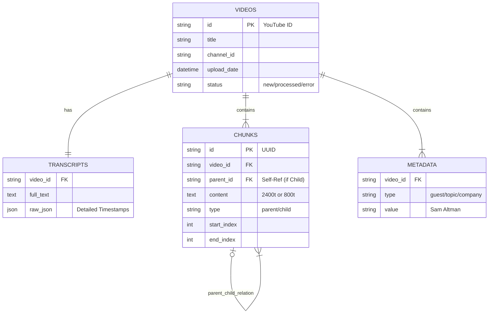

# Podcast RAG - Detailed Architecture

## System Flow (File-Level)

```mermaid
graph TB
    subgraph "External World"
        YT[YouTube]
        Anthropic[Anthropic API]
        Cohere[Cohere API]
    end

    subgraph "Local Ingestion (Phase 3)"
        CLI_INGEST[CLI: ingest] -->|call| SCRAPER[src/scraper.py]
        SCRAPER -->|Net| YT
        YT -->|Video IDs| SCRAPER
        SCRAPER -->|Filter Existing| DB_VIDEOS[(SQLite: videos)]
        
        TRANSCRIPT[src/transcripts.py] -->|For Each New Video| YT
        YT -->|Raw Text| TRANSCRIPT
        TRANSCRIPT -->|Store| DB_TRANSCRIPTS[(SQLite: transcripts)]
        
        META[src/metadata.py] -->|Send Text (First 10k)| Anthropic
        Anthropic -->|JSON (Guests/Topics)| META
        META -->|Store| DB_META[(SQLite: metadata)]
    end

    subgraph "Processing (Phase 4)"
        CHUNKER[src/chunking.py] -->|Read| DB_TRANSCRIPTS
        CHUNKER -->|Split 2400t| PARENT_CHUNKS[Parent Chunks]
        CHUNKER -->|Split 800t| CHILD_CHUNKS[Child Chunks]
        
        EMBED[src/embeddings.py] -->|Read| CHILD_CHUNKS
        EMBED -->|Generate| ST[SentenceTransformer Local]
        ST -->|Vectors| CHROMA[(ChromaDB: podcast_chunks)]
        
        PARENT_CHUNKS -->|Store| DB_CHUNKS[(SQLite: chunks)]
    end

    subgraph "Retrieval (Phase 5)"
        CLI_QUERY[CLI: query] -->|User Text| RETRIEVER[src/retrieval.py]
        RETRIEVER -->|BM25 Search| RAM_INDEX[In-Memory BM25]
        RETRIEVER -->|Vector Search| CHROMA
        
        RAM_INDEX -->|Ranked IDs| FUSION[RRF Fusion]
        CHROMA -->|Ranked IDs| FUSION
        FUSION -->|Top 10| RERANK[Cohere Rerank]
        RERANK -->|Net| Cohere
        Cohere -->|Top 5 Contexts| CONTEXT[Context Assembler]
        
        CONTEXT -->|Fetch Text| DB_CHUNKS
    end

    subgraph "Synthesis (Phase 6)"
        LLM[src/query.py] -->|System Prompt + Context| Anthropic
        Anthropic -->|Stream| STDOUT[Console Output]
    end

    style YT fill:#f00,color:#fff
    style Anthropic fill:#333,color:#fff
    style Cohere fill:#333,color:#fff
    style DB_VIDEOS fill:#ccf,stroke:#333
    style CHROMA fill:#ccf,stroke:#333
    style DB_CHUNKS fill:#ccf,stroke:#333
```

## Conceptual Data Model



## Key Interactions
1.  **Ingestion:** Scrapes video IDs -> Checks `VIDEOS` table -> Fetches Transcript -> Calls Haiku for `METADATA`.
2.  **Chunking:** Reads `TRANSCRIPTS` -> Creates huge `Parent` chunks -> Splits them into smaller `Child` chunks -> Stores everything in `CHUNKS` table.
3.  **Embedding:** Reads only `Child` chunks -> Generates embeddings -> Stores in ChromaDB with `parent_id` metadata.
4.  **Retrieval:** Searches ChromaDB for `Child` chunks -> Looks up their `parent_id` -> Fetches the big `Parent` text from SQLite -> Sends huge text to LLM.
