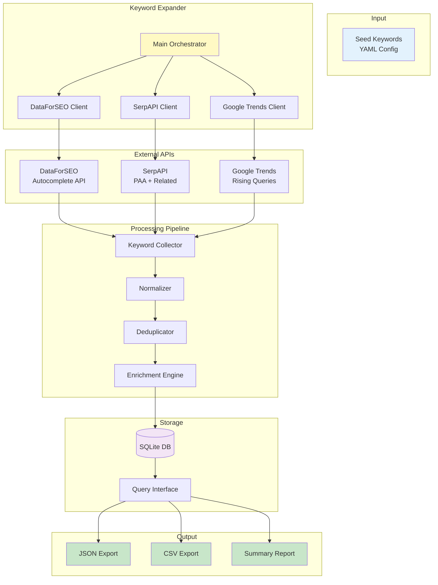
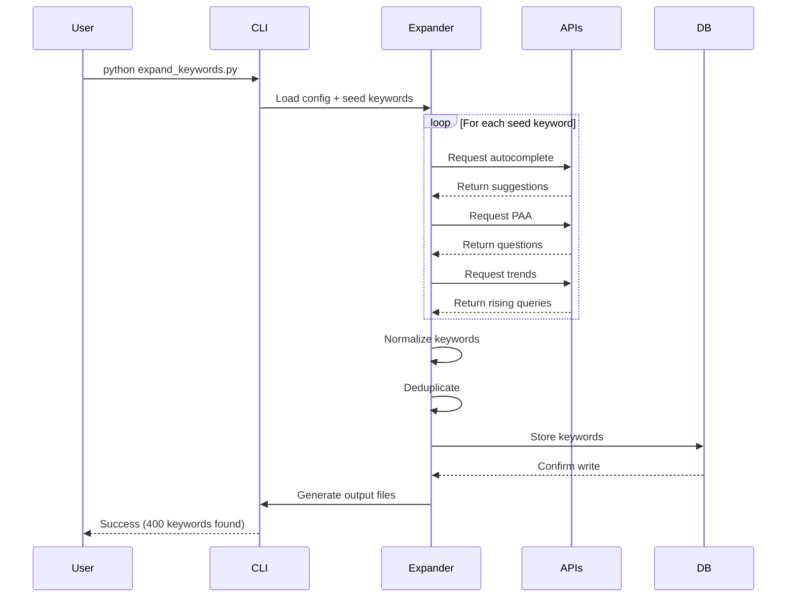
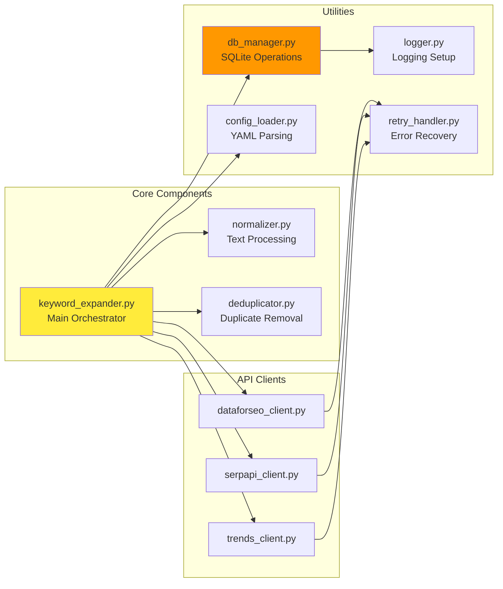
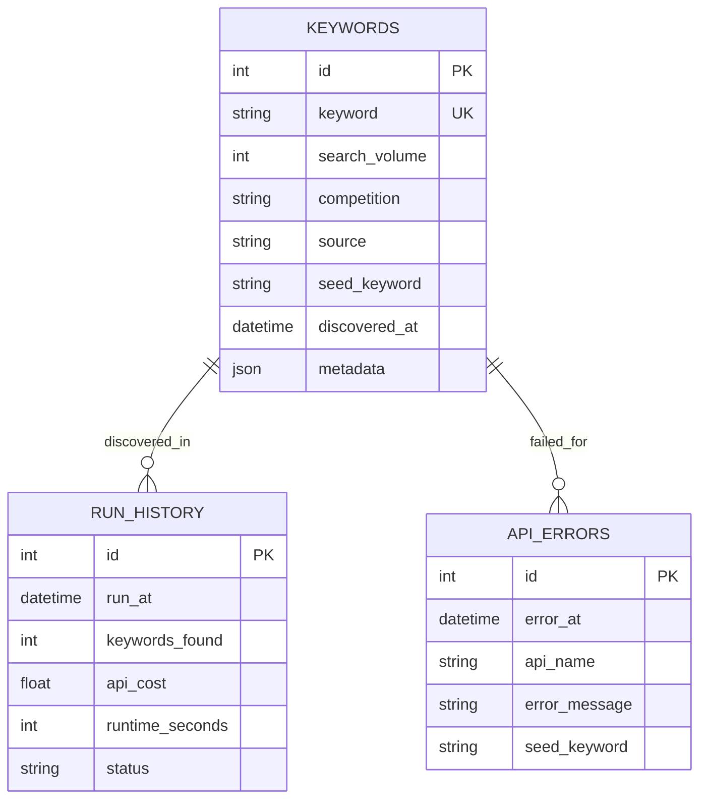
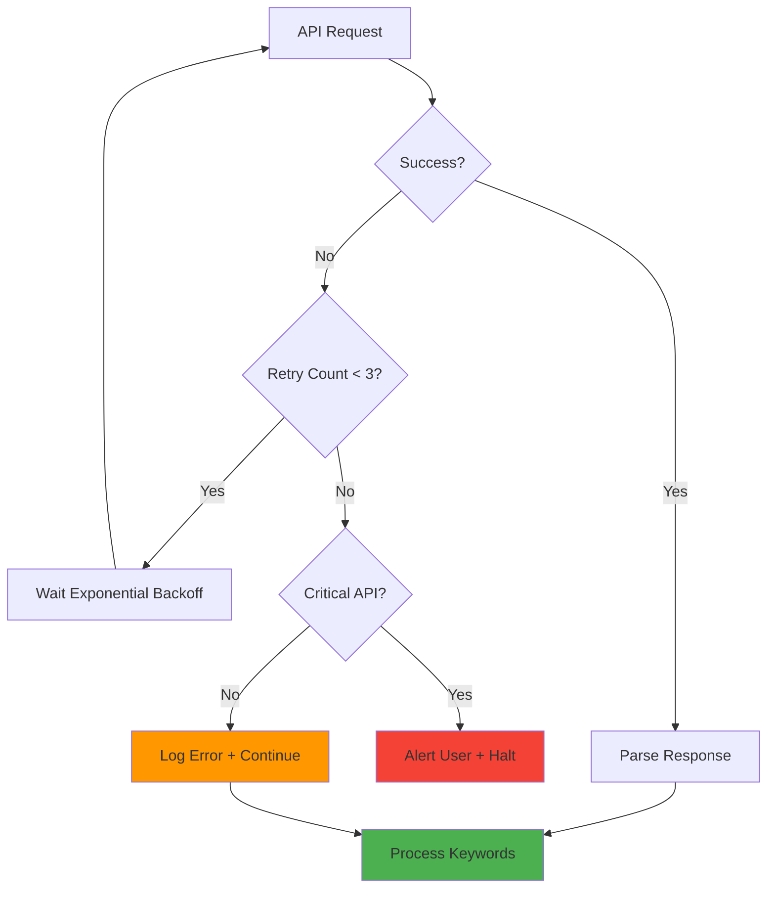
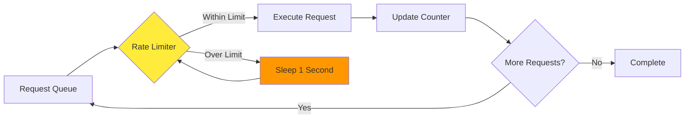
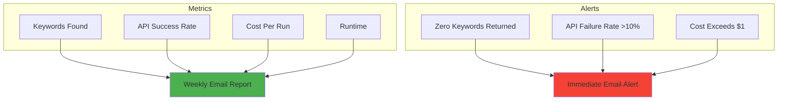
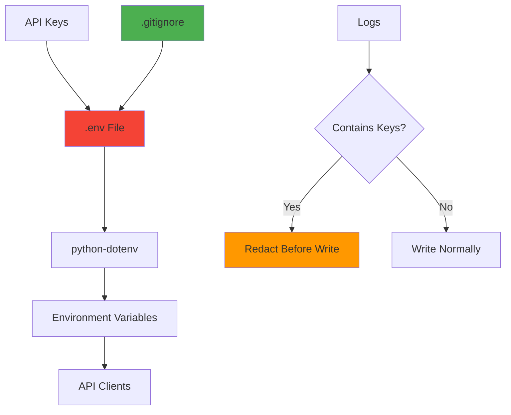

# Keyword Expansion System - Architecture

## System Overview



---

## Data Flow Diagram



---

## Component Architecture



---

## File Structure

```
SEO_1/
├── config/
│   ├── seed_keywords.yaml       # Input: List of seed keywords
│   └── settings.yaml            # Pipeline configuration
│
├── src/
│   ├── __init__.py
│   ├── keyword_expander.py      # Main orchestrator
│   ├── api_clients/
│   │   ├── __init__.py
│   │   ├── dataforseo_client.py # DataForSEO integration
│   │   ├── serpapi_client.py    # SerpAPI integration
│   │   └── trends_client.py     # Google Trends wrapper
│   ├── processing/
│   │   ├── __init__.py
│   │   ├── normalizer.py        # Keyword normalization
│   │   └── deduplicator.py      # Duplicate detection
│   └── utils/
│       ├── __init__.py
│       ├── db_manager.py        # SQLite operations
│       ├── config_loader.py     # YAML config parser
│       ├── logger.py            # Logging setup
│       └── retry_handler.py     # Retry logic
│
├── output/
│   ├── expanded_keywords.json   # Main output
│   ├── keywords.db              # SQLite database
│   └── summary_report.txt       # Run summary
│
├── tests/
│   ├── test_normalizer.py
│   ├── test_deduplicator.py
│   └── test_api_clients.py
│
├── logs/
│   └── keyword_expansion.log    # Application logs
│
├── .env                         # API keys (NOT in git)
├── .gitignore
├── requirements.txt             # Python dependencies
├── README.md                    # Setup guide
├── todo.md                      # Development checklist
├── implementation_plan.md       # Technical spec
├── architecture.md              # This file
└── expand_keywords.py           # CLI entry point
```

---

## Database Schema



---

## Error Handling Flow



---

## API Rate Limiting Strategy



**Rate Limits:**
- DataForSEO: 2000/min → We cap at 50/min (safe margin)
- SerpAPI: 100/hour → We cap at 20/hour
- Google Trends: ~400/hour → We cap at 100/hour + 2s delays

---

## Monitoring Dashboard (Future)



---

## Deployment Architecture (Weekly Automation)


---

## Technology Stack

| Layer | Technology | Purpose |
|-------|------------|---------|
| **Language** | Python 3.9+ | Core implementation |
| **APIs** | DataForSEO, SerpAPI | Keyword data sources |
| **Database** | SQLite | Keyword storage |
| **Config** | YAML | Configuration files |
| **HTTP** | `requests` | API calls |
| **Trends** | `pytrends` | Google Trends wrapper |
| **Retry** | `tenacity` | Exponential backoff |
| **Logging** | Built-in `logging` | Error tracking |
| **Testing** | `pytest` | Unit/integration tests |
| **CLI** | `argparse` | Command-line interface |

**Total Dependencies:** 6 packages (~15MB)

---

## Security Architecture



**Security Measures:**
1. API keys never hardcoded
2. `.env` file in `.gitignore`
3. Logs redact sensitive data
4. No PII stored in database

---

## Scalability Considerations

**Current Design (Step 1):**
- Handles: 10 seed keywords → 300-500 results
- Runtime: 3-5 minutes
- Storage: ~1MB database

**Future Scale (Steps 2-5):**
- Handles: 50 seeds → 2000+ keywords
- Runtime: 15-20 minutes
- Storage: ~10MB database

**Bottlenecks:**
- API rate limits (solved by throttling)
- SQLite write speed (fine until 100k+ keywords)

**When to Upgrade:**
- If seeds >100 → Switch to PostgreSQL
- If runtime >30 min → Parallelize API calls
- If cost >$10/run → Implement smarter caching

---

This architecture supports the current Step 1 requirements while remaining flexible for Steps 2-5 expansion (intent classification, SERP analysis, clustering, prioritization).
