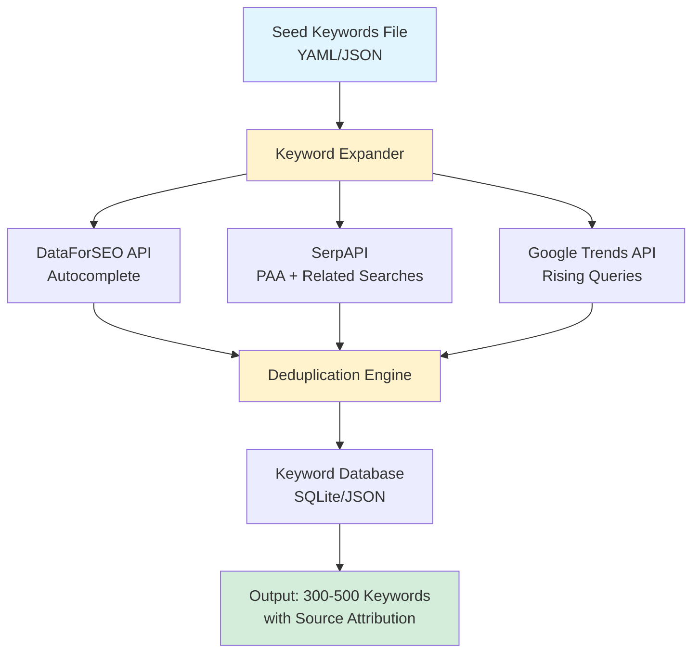

# Step 1: Keyword Expansion Implementation Plan

## Goal
Build an automated keyword expansion system that takes 5-15 seed keywords and generates 300-500 relevant keyword candidates using legitimate APIs (DataForSEO + SerpAPI). Output includes source attribution, search volume, and metadata for downstream intent classification.

---

## Architecture Overview



---

## Technical Specifications

### Input Format
**File:** `config/seed_keywords.yaml`

```yaml
seed_keywords:
  - "cozy gaming accessories"
  - "aesthetic desk setup"
  - "animal crossing merchandise"
  - "stardew valley gifts"
  - "mushroom keychain"
  
settings:
  target_keyword_count: 400
  min_search_volume: 50
  max_keyword_length: 60  # characters
```

### Output Format
**File:** `output/expanded_keywords.json`

```json
[
  {
    "keyword": "cozy gaming desk accessories",
    "search_volume": 1200,
    "competition": "low",
    "source": "google_autocomplete",
    "seed_keyword": "cozy gaming accessories",
    "discovered_at": "2026-02-03T21:18:00Z",
    "metadata": {
      "cpc": 0.85,
      "trend_direction": "rising"
    }
  }
]
```

---

## API Integration Details

### 1. DataForSEO - Google Autocomplete
**Endpoint:** `https://api.dataforseo.com/v3/keywords_data/google/suggestions/live`

**Request Example:**
```json
POST /v3/keywords_data/google/suggestions/live
{
  "keyword": "cozy gaming accessories",
  "location_code": 2840,  // USA
  "language_code": "en"
}
```

**Response Fields We Need:**
- `keyword` - The autocomplete suggestion
- `search_volume` - Monthly searches
- `competition` - Low/medium/high
- `cpc` - Cost per click (indicates commercial intent)

**Rate Limits:**
- 2000 requests/minute
- We'll use ~10-15 requests per run (one per seed keyword)

**Cost:**
- $0.0002 per request
- 10 seeds = $0.002 per run
- **Monthly cost: ~$0.01** (weekly runs)

**Error Handling:**
- Retry failed requests 3x with exponential backoff
- Cache successful responses for 7 days
- Fallback to SerpAPI if DataForSEO is down

---

### 2. SerpAPI - People Also Ask + Related Searches
**Endpoint:** `https://serpapi.com/search`

**Request Example:**
```python
params = {
  "engine": "google",
  "q": "cozy gaming accessories",
  "api_key": "YOUR_KEY",
  "location": "United States",
  "hl": "en",
  "gl": "us"
}
```

**Response Fields We Need:**
- `related_searches[]` - Bottom of SERP related keywords
- `people_also_ask[].question` - PAA questions (convert to keywords)
- `organic_results[].title` - Extract keyword patterns from titles

**Rate Limits:**
- 100 searches/hour on free tier
- We'll use ~10-15 searches per run

**Cost:**
- $0.005 per search (paid tier for higher limits)
- 10 searches = $0.05 per run
- **Monthly cost: ~$0.20** (weekly runs)

**Error Handling:**
- Switch to ValueSERP as fallback ($0.002/search)
- Cache SERP results for 7 days
- Log missing fields (not all queries have PAA)

---

### 3. Google Trends API (Pytrends)
**Library:** `pytrends` (unofficial but stable)

**Usage:**
```python
from pytrends.request import TrendReq

pytrend = TrendReq(hl='en-US', tz=360)
pytrend.build_payload(['cozy gaming'], timeframe='today 3-m')

# Get rising queries
rising = pytrend.related_queries()['cozy gaming']['rising']
```

**What We Extract:**
- Rising queries (emerging keywords with >100% growth)
- Related topics (for semantic expansion)
- Interest over time (identify trending vs declining seeds)

**Rate Limits:**
- ~400 requests/hour (unofficial, varies)
- Implement 2-second delays between requests

**Cost:** Free

**Error Handling:**
- Google Trends blocks aggressive scraping
- Use rotating timeframes to avoid detection
- Fallback: Skip trends data if blocked (not critical)

---

## Deduplication Strategy

### Problem:
Different APIs return overlapping keywords (e.g., both autocomplete and related searches might return "cozy desk setup")

### Solution:
```python
def normalize_keyword(kw):
    # Lowercase, remove extra spaces, strip punctuation
    return re.sub(r'[^\w\s]', '', kw.lower().strip())

def deduplicate(keywords):
    seen = {}
    for kw in keywords:
        normalized = normalize_keyword(kw['keyword'])
        if normalized not in seen:
            seen[normalized] = kw
        else:
            # Keep the one with higher search volume
            if kw['search_volume'] > seen[normalized]['search_volume']:
                seen[normalized] = kw
    return list(seen.values())
```

**Rules:**
1. Normalize to lowercase + remove punctuation
2. If duplicates, keep the version with highest search volume
3. Preserve source attribution (comma-separated if from multiple sources)

---

## Data Storage

### Option A: SQLite Database (Recommended)
**Schema:**
```sql
CREATE TABLE keywords (
    id INTEGER PRIMARY KEY,
    keyword TEXT UNIQUE NOT NULL,
    search_volume INTEGER,
    competition TEXT,
    source TEXT,
    seed_keyword TEXT,
    discovered_at TIMESTAMP,
    metadata JSON
);

CREATE INDEX idx_search_volume ON keywords(search_volume DESC);
CREATE INDEX idx_source ON keywords(source);
```

**Pros:**
- ✅ Easy to query (SQL)
- ✅ Handles duplicates automatically (UNIQUE constraint)
- ✅ No external database needed
- ✅ Can track keyword history over time

### Option B: JSON File
**Pros:**
- ✅ Simple, no database setup
- ✅ Easy to version control

**Cons:**
- ⚠️ Slower for large datasets (1000+ keywords)
- ⚠️ Manual deduplication needed

**Recommendation:** Start with SQLite, it's only 20 lines of setup code

---

## Error Handling & Monitoring

### Critical Failures:
1. **API key invalid/expired**
   - Action: Send email alert, halt execution
   - Mitigation: Test API keys in health check before main run

2. **Rate limit exceeded**
   - Action: Queue remaining requests, resume in 1 hour
   - Mitigation: Track request counts, throttle proactively

3. **No keywords returned** (all sources failed)
   - Action: Log error, send alert, use previous week's data
   - Mitigation: Keep 30-day rolling cache

### Non-Critical Failures:
1. **Google Trends blocked**
   - Action: Skip trends data, proceed with other sources
   - Impact: 10-15% fewer keywords (acceptable)

2. **Individual keyword request failed**
   - Action: Retry 3x, then skip
   - Impact: Lose 1 keyword (negligible)

### Monitoring Dashboard:
Track weekly:
- Total keywords discovered
- Keywords per source (autocomplete vs PAA vs trends)
- API success rate (%)
- API costs
- Runtime (should be <5 minutes)

---

## Development Workflow

### Phase 1: API Integration (Days 1-2)
1. Set up API keys (DataForSEO, SerpAPI)
2. Write API wrapper functions with error handling
3. Test with 3 seed keywords manually

**Success Criteria:** Return 30-50 keywords from 3 seeds

### Phase 2: Deduplication & Storage (Day 3)
1. Implement normalization logic
2. Set up SQLite database
3. Test deduplication with overlapping results

**Success Criteria:** 300 keywords from 10 seeds with <5% duplicates

### Phase 3: Configuration & Automation (Day 4)
1. Create YAML config file
2. Add command-line interface
3. Write unit tests for critical functions

**Success Criteria:** Run `python expand_keywords.py` and get 400 keywords in JSON

### Phase 4: Monitoring & Error Handling (Day 5)
1. Add logging (file + console)
2. Implement retry logic
3. Create cost tracking

**Success Criteria:** Pipeline runs successfully even if 1 API fails

---

## Cost Analysis

### Monthly Costs (Weekly Runs)
| Service | Requests/Run | Cost/Request | Weekly | Monthly |
|---------|--------------|--------------|--------|---------|
| DataForSEO | 10 | $0.0002 | $0.002 | $0.01 |
| SerpAPI | 10 | $0.005 | $0.05 | $0.20 |
| Google Trends | 10 | Free | $0 | $0 |
| **Total** | | | **$0.052** | **$0.21** |

### Annual Cost: ~$2.50

**Budget Threshold:**
If monthly costs exceed $5, switch to:
- Free tier rotation (Answer The Public, AlsoAsked)
- Reduce run frequency (bi-weekly instead of weekly)

---

## Testing Strategy

### Unit Tests:
```python
def test_normalize_keyword():
    assert normalize_keyword("Cozy Gaming!") == "cozy gaming"
    assert normalize_keyword("  desk setup  ") == "desk setup"

def test_deduplication():
    keywords = [
        {"keyword": "cozy gaming", "search_volume": 100},
        {"keyword": "Cozy Gaming!", "search_volume": 200}
    ]
    result = deduplicate(keywords)
    assert len(result) == 1
    assert result[0]['search_volume'] == 200
```

### Integration Tests:
- Test real API calls with 1-2 seeds (use test API keys)
- Verify JSON output format
- Confirm SQLite writes succeed

### End-to-End Test:
- Run full pipeline with 5 seeds
- Verify 150+ keywords returned
- Check output file exists and is valid JSON

---

## Security Considerations

1. **API Keys:**
   - Store in `.env` file (never commit to git)
   - Use `python-dotenv` to load
   - Add `.env` to `.gitignore`

2. **Rate Limit Protection:**
   - Hard cap at 50 requests/minute (well below API limits)
   - Use `tenacity` library for exponential backoff

3. **Data Privacy:**
   - Keywords are not PII
   - Don't log API responses (could contain keys in URLs)

---

## Future Enhancements (Not in Scope for Step 1)

- [ ] Add more sources (Reddit API, Pinterest Trends)
- [ ] Implement ML-based keyword filtering (remove low-quality)
- [ ] A/B test different autocomplete locations (UK vs US)
- [ ] Track keyword performance over time (rising vs falling)
- [ ] Auto-detect new trending topics weekly

---

## Dependencies

```txt
requests>=2.31.0
pytrends>=4.9.0
python-dotenv>=1.0.0
tenacity>=8.2.0
pyyaml>=6.0
```

**Total package size:** ~15MB (lightweight)

---

## Success Metrics

After implementing Step 1, we should have:

- ✅ 300-500 keywords from 10 seed keywords
- ✅ <5% duplicate rate
- ✅ 95%+ API success rate
- ✅ <5 minute runtime per weekly run
- ✅ <$0.25 cost per run
- ✅ Keywords stored in queryable database
- ✅ Source attribution for every keyword

**Validation Gate:**
Manually review 50 random keywords - are they relevant and diverse? If not, adjust seed keywords or API parameters before proceeding to Step 2.
